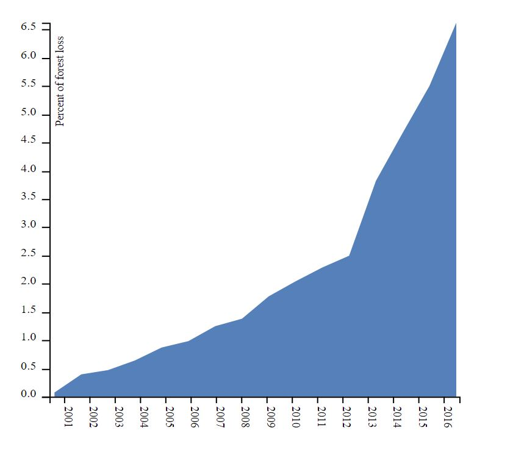

# D3 Area Chart

**geoviz type**: Area Chart | **last updated**: 06 May 18 | **applicable data types**: svg, jpg, html, css | **Contributors:** [Alex Walters](https://github.com/walteral/)

[Live Demo] (index.html)

## 1\. Set up the workspace

This project will present an area chart using D3 javascript library. 

## 2\. Data Sources
The data being displayed is the cumulative percentage of forest loss within Guinea-Bissau by year based on the total forest cover within Guinea-Bissau in the year 2000. This dataset was derived from the Hansen Global Forest dataset provided free with Google Earth Engine. 

## 3\. A function-by-function Tutorial

###### First we need to set up the SVG area for us to populate later. This creates an SVG element and constrants the margins so that we can add in our labels laters without overlay. When we append the "g" to the SVG we are adding a "group" element, here we are subtracting the margins from the total svg size. 

    var svg = d3.select("svg"),
        margin = {top: 20, right: 20, bottom: 30, left: 50},
        width = +svg.attr("width") - margin.left - margin.right,
        height = +svg.attr("height") - margin.top - margin.bottom,
        g = svg.append("g").attr("transform", "translate(" + margin.left + "," + margin.top + ")");

 ###### This establishes the "buckets" or bins used in the graph along the x-axis. The padding seperates that bars so that they don't blend together.

         var x = d3.scaleBand().range([0, width]).padding(0.2);
###### The y-axis is scaled linearly and rounded. This lets us fit in our graph even if the scale is greater than 400 (the nubmer of pixels in our SVG)
    var y = d3.scaleLinear()
        .rangeRound([height, 0]);

###### Area generates the area under the curve that gets drawn onto the graph later. It also establishes the "d.date" as the x variable and the "d.close" variable as the y variable.
    var area = d3.area()
        .x(function(d) { return x(d.date); })
        .y1(function(d) { return y(d.close); });

###### finally we bring in the dataset and perform several functions on it
    d3.csv("assets/walteral_data_lab04.csv", function(d) {

###### Converts the data from the default string variables and returns a interger.
        d.date = +d.date;
        d.close = +d.close;
        return d;

###### This part of the function is where the graph gets drawn onto the page.
    }).then(function( data) {

###### establish the domain of the variables, this is encompasses the entire numerical value of the axis.
        x.domain(data.map(function(d) { return d.date; }));
        y.domain([0, d3.max(data, function(d) { return d.close; })]);
        area.y0(y(0));

###### populates the area under the curve with the data that is provided
        g.append("path")
            .datum(data)
            .attr("fill", "#5581ba")
            .attr("d", area);

###### creates the x-axis on the bottom of the graph based on the height of the SVG. This also appends the axis labels rotated 90 degrees along the x axis
        g.append("g")
            .attr("transform", "translate(0," + height + ")")
            .call(d3.axisBottom(x))
            .selectAll("text")
            .attr("y", 0)
            .attr("x", 9)
            .attr("dy", ".35em")
            .attr("transform", "rotate(90)")
            .style("text-anchor", "start");

###### creates and populates the y axis with the tixks and the label

        g.append("g")
            .call(d3.axisLeft(y))
            .append("text")
            .attr("fill", "#000")
            .attr("transform", "rotate(270)")
            .attr("y", 6)
            .attr("dy", "0.71em")
            .attr("text-anchor", "end")
            .text("Percent of forest loss");
    });

## 4\. More examples of similiar geovisualizations
- Bubble Chart: https://bl.ocks.org/mbostock/4063269

- Streamgraph https://bl.ocks.org/mbostock/4060954 

- Voronoi: https://bl.ocks.org/mbostock/4060366

- Word Cloud: https://www.jasondavies.com/wordcloud/ 

- Calendar Heatmap: http://bl.ocks.org/oyyd/859fafc8122977a3afd6 

- Force Atlas: https://bl.ocks.org/heybignick/3faf257bbbbc7743bb72310d03b86ee8

- Area Chart: https://bl.ocks.org/mbostock/3883195 

- Pie Donut Chart: http://bl.ocks.org/dbuezas/9306799

- Sankey diagram: https://github.com/d3/d3-sankey 

- Hexagon map: http://bl.ocks.org/tnightingale/4668062 

- D3 Liquid Fill Gauge: http://bl.ocks.org/brattonc/5e5ce9beee483220e2f6 

## Acknowledgement
I would like to acknowledge Mike Bostock for creating the D3 javascript library. 

## References
[https://d3js.org/](https://d3js.org/)

