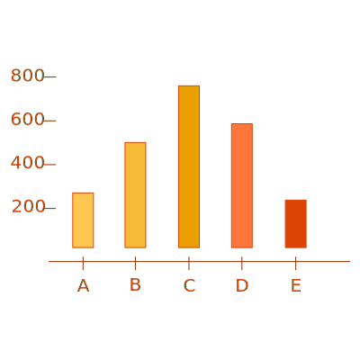

# Bar Chart

A bar chart is a chart with rectangular bars with lengths proportional to the values that they represent.  One axis of the chart shows the specific categories being compared, and the other axis represents a discrete value.

Bar charts provide a visual presentation of categorical data. Categorical data is a grouping of data into discrete groups, such as months of the year, age group, shoe sizes, and animals. These categories are usually qualitative. Bars on the chart may be arranged in any order.

[Live Demo](http://geoviz.ceoas.oregonstate.edu/neocarto/modules/graphics/bar/index.html)

    <!DOCTYPE html>
    <html lang="en">
    
    <head> 
        
        <link rel="stylesheet" href="css/billboard.css">
            
    </head>
    <body>
        

       
    </body>
    
    </html>

[More info](http://datavizproject.com/data-type/bar-chart/)