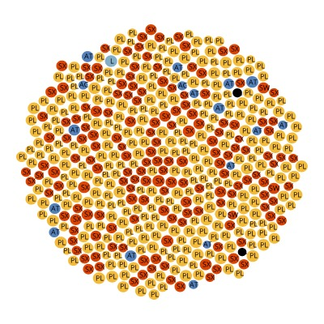

# Bubble Chart Major Tree Species

**Bubble Chart** | **11 May 2018** | **applicable data types** | **Contributors:** [Anna Talucci](https://github.com/taluccia)



This geoviz module is depicting the dominant canopy tree species and percentage of that species for an area. 

The landscape area of interest was based on a fire perimeter. The bubble chart shows that Lodgepole pine (LP) is the dominant canopy species occupying much of the landscape (in yellow). White Spruce Hybrid (SX) is another dominant species (in red), but covers much less area on the landscape compared to Lodgepole pine. Aspen (AT) is also dominant species (in blue), but Apsen occupies a very small portion of the landscape. The url can be accessed [here](https://taluccia.github.io/geog4572.lab4.taluccia/index.html).


## 1\. Set up the workspace

Set of the workspace with appropriate files including an assets file to hold the data. Open webstorm and navigate to the work file you set up. Create a new html document and name it `index.html`. 

Set up the head with the necessary meta data, svg dimensions, and script for d3v4.

The svg dimensions include the font-family and font-size to meet the specifications. A separate style file was not included for the project.

```javascript
<!DOCTYPE html>

<head>
    <meta charset="utf-8">
    <svg width="400" height="400" font-family="open-sans" font-size="10" text-anchor="middle"></svg>
    <script src="https://d3js.org/d3.v4.min.js"></script>
</head>
```


Set dimensions and margins of graph to meet specifications.

``` javascript
        var svg = d3.select("svg"),
            margin = {top: 20, right: 20, bottom: 30, left: 40},
            width = +svg.attr("width") - margin.left - margin.right,
            height = +svg.attr("height") - margin.top - margin.bottom;
```


Define colors to meet specifications.

```javascript
var color = d3.scaleOrdinal(['#dc4404', '#f3bb3b', '#5581ba', 'dcdbdb', '#84aec8']);
```


Define the padding for the bubble chart

```javascript
    var pack = d3.pack()
        .size([width, height])
        .padding(1.5);
```


## 2\. Data Sources

The data used here is from the Vegetation Resource Inventory. VRI data for this chart was extracted from a polygon shape file and is a subset of a very large data set. The data was compiled into a csv file that included dominant canopy tree species and the percent cover for a given polygon. 

The csv file was saved in the assets folder and added to the html file. 

```javascript
    d3.csv("assets/tweed_vir2.csv", function(d) {
        d.value = +d.value;
        if (d.value) return d;
    }, function(error, classes) {
        if (error) throw error;
```


## 3\. Assembling the Bubble Chart

So far we have set up the header with svg dimensions and script for d3.v4.  We have defined the svg element dimensions, the color scheme, and padding, and read in out csv file.

```javascript
<!DOCTYPE html>

<head>
    <meta charset="utf-8">
    <svg width="400" height="400" font-family="open-sans" font-size="10" text-anchor="middle"></svg>
    <script src="https://d3js.org/d3.v4.min.js"></script>
</head>

<body>
<script>


    var svg = d3.select("svg"),
        margin = {top: 20, right: 20, bottom: 30, left: 40},
        width = +svg.attr("width") - margin.left - margin.right,
        height = +svg.attr("height") - margin.top - margin.bottom;


    var color = d3.scaleOrdinal(['#dc4404', '#f3bb3b', '#5581ba', 'dcdbdb', '#84aec8']);

    var pack = d3.pack()
        .size([width, height])
        .padding(1.5);

    d3.csv("assets/tweed_vir2.csv", function(d) {
        d.value = +d.value;
        if (d.value) return d;
    }, function(error, classes) {
        if (error) throw error;
```

Now we will add script to create bubbles based on tree species and percent of the canopy they occupy for a segment of the landscape. 

After we read in the data from the csv file, we define our root variable

```javascript
    d3.csv("assets/tweed_vir2.csv", function(d) {
        d.value = +d.value;
        if (d.value) return d;
    }, function(error, classes) {
        if (error) throw error;

        var root = d3.hierarchy({children: classes})
            .sum(function(d) { return d.value; })
            .each(function(d) {
                if (id = d.data.id) {
                    var id, i = id.lastIndexOf(".");
                    d.id = id;
                    d.package = id.slice(0, i);
                    d.class = id.slice(i + 1);
                }
            });
```


 We then define our `node`, which will allow us to generate the bubbles (circles) and add text to label the bubbles (circles). 

``` javascript
        var node = svg.selectAll(".node")
            .data(pack(root).leaves())
            .enter().append("g")
            .attr("class", "node")
            .attr("transform", function(d) { return "translate(" + d.x + "," + d.y + ")"; });


        node.append("circle")
            .attr("id", function(d) { return d.id; })
            .attr("r", function(d) { return d.r; })
            .style("fill", function(d) { return color(d.package); });


        node.append("clipPath")
            .attr("id", function(d) { return "clip-" + d.id; })
            .append("use")
            .attr("xlink:href", function(d) { return "#" + d.id; });

        node.append("text")
            .attr("clip-path", function(d) { return "url(#clip-" + d.id + ")"; })
            .selectAll("tspan")
            .data(function(d) { return d.class.split(/(?=[A-Z][^A-Z])/g); })
            .enter().append("tspan")
            .attr("x", 0)
            .attr("y", function(d, i, nodes) { return 13 + (i - nodes.length / 2 - 0.5) * 10; })
            .text(function(d) { return d; });
       
		node.append("title")
            .text(function(d) { return d.id + "\n" + format(d.value); });
    });

```

Here is the code in its entirety:

```javascript
<!DOCTYPE html>

<head>
    <meta charset="utf-8">
    <svg width="400" height="400" font-family="open-sans" font-size="10" text-anchor="middle"></svg>
    <script src="https://d3js.org/d3.v4.min.js"></script>
</head>

<body>
<script>


    var svg = d3.select("svg"),
        margin = {top: 20, right: 20, bottom: 30, left: 40},
        width = +svg.attr("width") - margin.left - margin.right,
        height = +svg.attr("height") - margin.top - margin.bottom;


    var color = d3.scaleOrdinal(['#dc4404', '#f3bb3b', '#5581ba', 'dcdbdb', '#84aec8']);

    var pack = d3.pack()
        .size([width, height])
        .padding(1.5);

    d3.csv("assets/tweed_vir2.csv", function(d) {
        d.value = +d.value;
        if (d.value) return d;
    }, function(error, classes) {
        if (error) throw error;

        var root = d3.hierarchy({children: classes})
            .sum(function(d) { return d.value; })
            .each(function(d) {
                if (id = d.data.id) {
                    var id, i = id.lastIndexOf(".");
                    d.id = id;
                    d.package = id.slice(0, i);
                    d.class = id.slice(i + 1);
                }
            });

        var node = svg.selectAll(".node")
            .data(pack(root).leaves())
            .enter().append("g")
            .attr("class", "node")
            .attr("transform", function(d) { return "translate(" + d.x + "," + d.y + ")"; });


        node.append("circle")
            .attr("id", function(d) { return d.id; })
            .attr("r", function(d) { return d.r; })
            .style("fill", function(d) { return color(d.package); });


        node.append("clipPath")
            .attr("id", function(d) { return "clip-" + d.id; })
            .append("use")
            .attr("xlink:href", function(d) { return "#" + d.id; });

        node.append("text")
            .attr("clip-path", function(d) { return "url(#clip-" + d.id + ")"; })
            .selectAll("tspan")
            .data(function(d) { return d.class.split(/(?=[A-Z][^A-Z])/g); })
            .enter().append("tspan")
            .attr("x", 0)
            .attr("y", function(d, i, nodes) { return 13 + (i - nodes.length / 2 - 0.5) * 10; })
            .text(function(d) { return d; });

        node.append("title")
            .text(function(d) { return d.id + "\n" + format(d.value); });
    });

</script>

</body>

</html>
```


## 4\. More examples of similar geovisualizations

Additional examples can be found through a google search of bubble charts.

http://vallandingham.me/bubble_charts_with_d3v4.html

https://bl.ocks.org/mbostock/4063269


## Acknowledgement

The below references were helpful in generating this project.


## References

- [Vegetation Resource Inventory (VRI) Data]( https://catalogue.data.gov.bc.ca/dataset/vri-forest-vegetation-composite-polygons-and-rank-1-layer)
- [Bubble Chart d3 v4](https://bl.ocks.org/mbostock/4063269)

  ​


