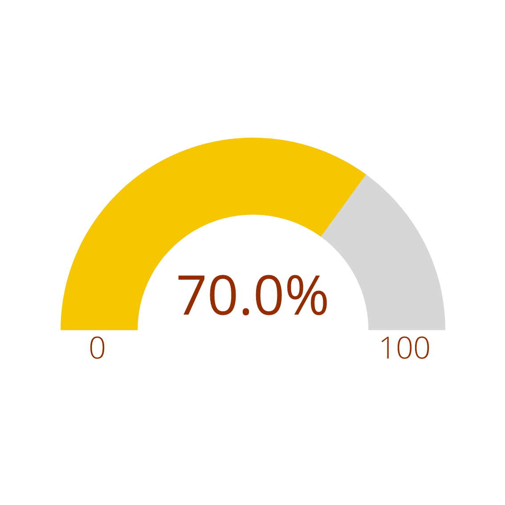

# Gauge Chart



[Live Demo](http://geoviz.ceoas.oregonstate.edu/neocarto/modules/charts/gauge/index.html)


A gauge, speedometer or dial chart is a combination of a pie chart and a doughnut chart in the same chart. In this kind of chart views a range of values of a business key. Most times this range is separated in three areas, red colored for low, green colored for high and orange between the other values. What a high value is depends on the context of the business key. An indicator, like an arrow or a needle, point on the present value. At once a users see if the value of the business key is good or bad.

This kind of chart seems to be popular but it has a lot of disadvantages. First a gauge chart is very big. It only shows less data points on a big area. With this space for umpteen charts like line or column charts for example.They show more data in an more efficient way. That the values are related to the angular orientation of the indicator is the second disadvantage of a gauge chart. The best way to view data is when data is plotted as length or positional features like bars, columns or points. In charts with these features an user can notice values more efficient and faster, experts have shown. Another drawback is that a dial chart is hard to build.

Html

```html
<!DOCTYPE html>
<html lang="en">

<head>
    <meta charset="UTF-8">
    <meta name="viewport" content="width=device-width, initial-scale=1.0">
    <script src="https://d3js.org/d3.v4.min.js"></script>
    <link rel="stylesheet" href="https://cdnjs.cloudflare.com/ajax/libs/billboard.js/1.3.0/billboard.min.css">
    <script src="https://cdnjs.cloudflare.com/ajax/libs/billboard.js/1.3.0/billboard.js"></script>
</head>

<body>
<div id="GaugeChart"></div>
<script>

</script>
</body>

</html>
```

Script

```javascript
var chart = bb.generate({
    data: {
        columns: [
            ["data", 91.4]
        ],
        type: "gauge",
        onclick: function (d, i) {
            console.log("onclick", d, i);
        },
        onover: function (d, i) {
            console.log("onover", d, i);
        },
        onout: function (d, i) {
            console.log("onout", d, i);
        }
    },
    gauge: {},
    color: {
        pattern: [
            "#FF0000",
            "#F97600",
            "#F6C600",
            "#60B044"
        ],
        threshold: {
            values: [
                30,
                60,
                90,
                100
            ]
        }
    },
    size: {
        height: 180
    },
    bindto: "#GaugeChart"
});

setTimeout(function() {
    chart.load({
        columns: [['data', 10]]
    });
}, 1000);

setTimeout(function() {
    chart.load({
        columns: [['data', 50]]
    });
}, 2000);

setTimeout(function() {
    chart.load({
        columns: [['data', 70]]
    });
}, 3000);

setTimeout(function() {
    chart.load({
        columns: [['data', 0]]
    });
}, 4000);

setTimeout(function() {
    chart.load({
        columns: [['data', 100]]
    });
}, 5000);

```

### More examples