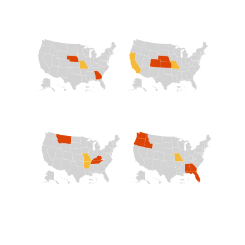

# Small Multiples Maps



[Live Demo](http://geoviz.ceoas.oregonstate.edu/neocarto/modules/charts/smallmultiples/index.html)

Small multiple maps allows to create multiple representations of the same visualization to make data visually comparable. In this example we are using multiple maps of the US showing which State has voted at a certain date (red=already voted, yellow=voting no color= did not vote yet). 

To make the code more comprehensible, it has been divided in its four components: map.geojson contains the data (date of vote and state boundaries); style.css defines the style of the visualization (colors, font etc.); index.html is the actual HTML page; script.js is the JavaScript code that using the library d3.js makes the visualization possible.

Let's start from the html page. The 'head' element is a container for metadata (data about data) and it is placed between the <html> tag and the <body> tag. Metadata is not displayed in the page and typically define the document title, character set, styles, links, scripts, and other meta information. In our example it defines the title and the links to the stylesheet (style.css) and the JavaScript library d3.js. In this case we loaded the library directly from d3js.org website, but we could as well download the library and keep it in a local folder.

The 'body' tag contains the visible part of the page. The 'div' tag defines a division or a section in an HTML document. The 'div' element is often used as a container for other HTML elements to style them with CSS or to perform certain tasks with JavaScript. In our page we have a 'div' called "maps" which contains the visualization displayed calling the JavaScript code contained in script.js.


```html
<!DOCTYPE html>
<html>
<head>
	<title>Small multiple maps</title>
    <link rel="stylesheet" href="style.css">
	<script src="http://d3js.org/d3.v3.min.js" charset="utf-8"></script>
</head>
<body>
    <div id="maps"></div>
    <script src="script.js"></script>
</body>
</html>
```

The core part of the document is the JavaScript code. The first few lines define variables (var) such as current date, height and width of each small map, the projection used and the date format. Then data (map.geojson) is loaded using d3.json and a function extracts the dates from the geojson file (d.properties.date) so that the States can be grouped by date (dateJoin). Then a map is drawn for each date as an SVG (Scalable Vector Graphics) file into the 'maps' div in the html document. Each SVG is drawn according to the boundaries defined in the .geojson file, colored according to what defined in the .css file and sized according to the dimension variables defined earlier in the script (mapWidth and mapHeight). Finally the function 'update' allows to draw the final visualization using the current date (defined in the first variable) to show which State has already voted and which has not for each date.

```javascript
var currentDate = '2014-2-10';
var mapWidth = 200;
var mapHeight = 120;

var projection = d3.geo.albersUsa()
    .scale(220)
    .translate([mapWidth / 2, mapHeight / 2]);

var path = d3.geo.path()
    .projection(projection);

var dateFormat = d3.time.format("%B %e");

d3.json("map.geojson", function(error, map) {
var dates_o = {};
map.features.forEach(function(d,i){
    if(!dates_o[d.properties.date]){
        dates_o[d.properties.date] = true;
    }
});
var dates = Object.keys(dates_o);
console.log(dates);

var dateJoin = d3.select('#maps').selectAll('div.map')
    .data(dates);

var divs = dateJoin.enter()
    .append('div').attr({
        'id':function(d){ return 'map_'+d; },
        'class':'map'
    })


    divs.append('p').text(function(d){ return dateFormat(new Date(d)); })

    var SVGs = divs.append('svg').attr({
        'width':mapWidth,
        'height':mapHeight
    });

    SVGs.each(function(date){
        d3.select(this).selectAll('path')
            .data(map.features)
            .enter().append("path")
                .attr({
                    "d":path,
                    "id":function(d){
                        return d.properties.name + date;
                    }
                });
    });

    function update(){
        SVGs.each(function(date){
            var now = new Date(date);
            d3.select(this).selectAll('path')
                .data(map.features)
                    .attr({
                        "class":function(d,i){
                            if(d.properties.date){
                                var stateDate = new Date(d.properties.date);
                                if(stateDate > now){
                                    return 'yet-to-vote';	
                                }else if(stateDate < now){
                                    return 'voted';
                                }
                                return 'voting';
                            }
                            return 'none';
                        }
                    });
        })
    }

    update();

});

```

[credits](http://bl.ocks.org/tomgp/9386620)

### More Examples

[1](https://bl.ocks.org/john-guerra/7bb8bf04742c84929fc5210d1f257e93)
[2](https://bl.ocks.org/armollica/6314f45890bcaaa45c808b5d2b0c602f)
