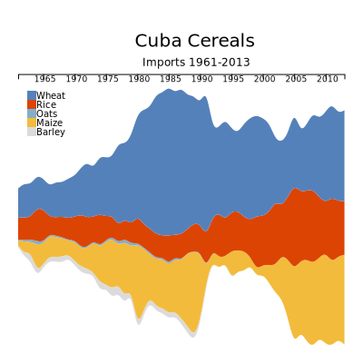
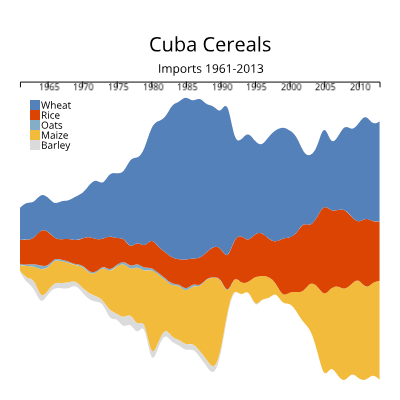

# cuba-streamgraph-d3

[Live Demo](http://geoviz.ceoas.oregonstate.edu/neocarto/modules/charts/streamgraph_2/index.html)

Streamgraph showing Cuba's cereal imports from 1961-2013 (data from FAO STAT).  The README.md file shows the 400x400px streamgraph with a legend.

The webpage itself (https://maxxyb33.github.io/cuba-streamgraph-d3/) DOES NOT have the streamgraph designed according to the course objectives; however, it does have tool-tip features, so you can hover over the graph to show grain type.
The button to update streamgraph with the Export data (same time period) is currently under development.

