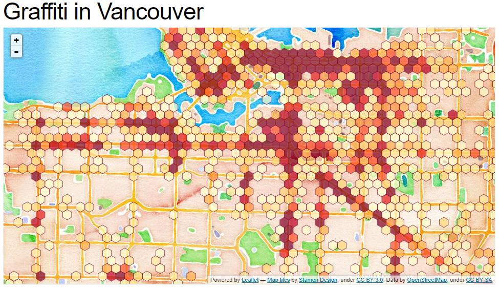
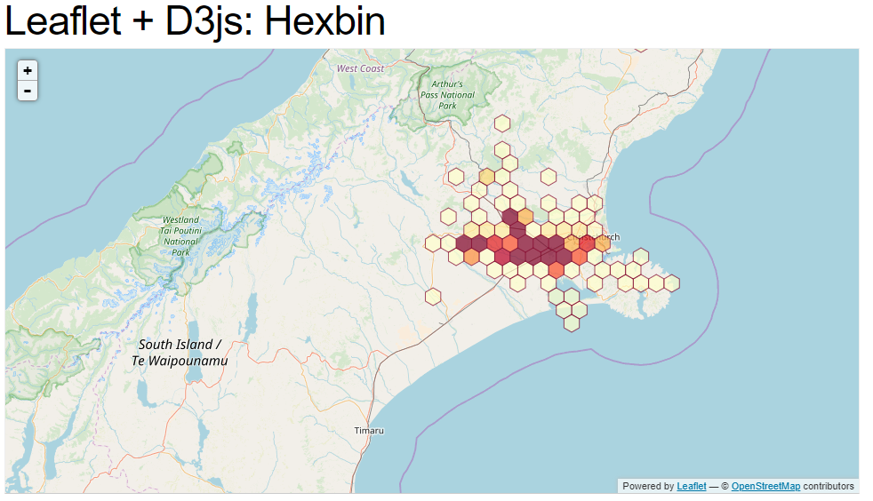

# HexagonMap


**HexagonMap**| **May 15, 2018** | **Earthquake in Tongariro New Zeland** | **Contributors:**
[Hoda Tahami](https://hodatahami.github.io/hexagonmap/)


[Live Demo](index.html)


This hexbin map shows the proximity of earthquakes in the Tongariro region of New Zealand in 2017.

The map is created using Leaflet. The hexbin layer is a custom Leaflet layer which uses d3js to generate a svg hexbin overlay.


 ### Set up the workspace

 The basic folder structure to generate a bubble plot should be as follows:
   ```powershell
   Bubblechart
       │index.html
       │readme.md
       ├─css
       │      style.css
       │      leaflet.css
       ├─js
       │      leaflet.hexbin-layer.js
       │      colorbrewer.js
       │      leaflet-src.js
       ├─img
       │      hexagonalmap.PNG
       │      newzeland.PNG
       │      vancouver.PNG
       ├─assets
            └─tongariro.geojson
            ─map.geojson
            
          
   ```

 

###  Data sources:

Earthquake data sourced from
[GeoNet ](https://quakesearch.geonet.org.nz/)Geological hazard information for New Zealand

### A function-by-function Tutorial

##### HTML
The html document should first call the relevant libraries, and title the document.
``` html
<!DOCTYPE html>
<html>
<head>
    <link rel="stylesheet" href="http://cdn.leafletjs.com/leaflet-0.5/leaflet.css" />
    <!--[if lte IE 8]>
    <link rel="stylesheet" href="http://cdn.leafletjs.com/leaflet-0.5/leaflet.ie.css" />
    <link rel="stylesheet" href="css/style.css">
    <![endif]-->

    <script src="https://d3js.org/d3.v3.min.js"></script>
    <script src="https://d3js.org/d3.hexbin.v0.js"></script>
    <script src="http://cdn.leafletjs.com/leaflet-0.5/leaflet-src.js"></script>

    <script type="text/javascript" src="js/colorbrewer.js"></script>
    <script type="text/javascript" src="js/leaflet.hexbin-layer.js"></script>

   
</head>
```

 Here I define the size of my chart.
``` html

     <style type="text/css">
            html, body { margin: 0; padding: 0; height: 400px; width: 400px; font: 10px "Open Sans" }
            #quake { min-height: 100%; }
            .hexagon { opacity: 0.7 }
        </style>
```


Next, I define the data-source as a format of geojason.
``` html

 <div id='quake' data-source="assets/tongariro.geojson"></div>
```
In next section, I use colorbrewer to choose the classes of color(I define yellow 
orange and red) then by using leaflet library I prepare the zoome scale and also the coordinate of the 
center of map and finally specify the basemap.

``` html
        
    (function () {
        var max, scale,
            classes = 9,
            scheme = colorbrewer["YlOrRd"][classes],
            container = L.DomUtil.get('quake'),
            //map = L.map(container).setView([-43.6, 172.3], 10);
            map = L.map(container).setView([-39.101545, 175.679850],6);

        var Esri_DeLorme = L.tileLayer('https://server.arcgisonline.com/ArcGIS/rest/services/Specialty/DeLorme_World_Base_Map/MapServer/tile/{z}/{y}/{x}', {
            attribution: 'Tiles &copy; Esri &mdash; Copyright: &copy;2012 DeLorme',
            minZoom: 1,
            maxZoom: 11
        }).addTo(map);
```

Define hex layer and add them to map

``` html
        
       d3.json(container.dataset.source, function(collection) {
               // When data arrives, create leaflet layer with custom style callback.
               L.hexLayer(collection, {
                   applyStyle: hex_style
               }).addTo(map);
           });

```

 * Determines a quantize scale (http://bl.ocks.org/4060606) based on the
    map's initial data density (which is based on the initial zoom level)
    and applies a colorbrewer (http://colorbrewer2.org/) colour scheme accordingly.

``` html
        
    function hex_style(hexagons) {
              // Maintain a density scale relative to initial zoom level.
              if (!(max && scale)) {
                  max = d3.max(hexagons.data(), function (d) { return d.length; });
                  scale = d3.scale.quantize()
                      .domain([0, max])
                      .range(d3.range(classes));
              }
  
              hexagons
                  .attr("stroke", scheme[classes - 1])
                  .attr("fill", function (d) {
                      return scheme[scale(d.length)];
                  });
          }
```
<hr>

### CSS
A stylesheet is added to style the text and lines on the plot.

``` html
body {
    font: 10px "Open Sans";
}

```


####  More examples of similiar geovisualizations:
 [Graffiti in Vancouver](http://bl.ocks.org/tnightingale/4711787)

 

 [Leaflet + D3js: Hexbin](http://bl.ocks.org/tnightingale/4668062)

 

 

## Acknowledgement
- [Tom Nightingale](https://gist.github.com/tnightingale) 


## References
- [D3.js](https://d3js.org/) 