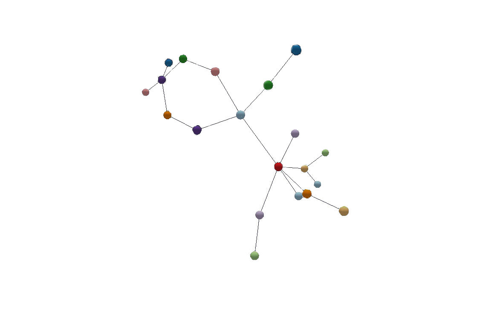

# 3D Force Graph
Single View | 5/15/2018 | Geovisualization: Geovisual Analytics | Author: [Bryce Bradshaw](https://github.com/bryceb09)


[Live Demo](http://geoviz.ceoas.oregonstate.edu/neocarto/modules/networks/3d-force-graph/index.html)

The force graph is created using D3 which, is a JavaScript library used for visualizing data with HTML, SVG, and CSV. The graph will be comprised of nodes and links connecting information to form a graph that will have the ability to allow users to manipulate through pulling the nodes, rotating the graph (since it has a 3D aspect), and mouse over to view the data that each node represents. 

## About the Data
The data used for the 3D Force Graph is describing the linkages bewteen various friends. The poeple are the nodes and the links are the friendships they have with one another. The data is comprised of 20 names with different frequencies of particles based on how close of friends they are. It is important to note that the force graph will only work if the data is broken up into nodes and links with some characteristics linking the nodes to eachother. 

## 1. Set up the workspace

In your IDE (Webstorm), open a blank `HTML` document to prepare for editing.

We will begin by adding the `d3.js` file to your blank `HTML` by adding it inside the `head` tag.

```JavaScript
<script src="https://unpkg.com/3d-force-graph@1.31.4/dist/3d-force-graph.js"></script>
```

## 1.1 Adding Style Tag

As of now you have added the `d3.js` file to your blank `HTML` file. Now we will add the `style` tag to your document which will be placed in the `head` along with the `d3.js`. Once you have done that your `HTML` file should look like this. Its important to note that the graph uses `Canvas` rather than `SVG` so the font and colors cannot be changed. That being said the main difference between `SVG` and `Canvas` is `Canvas` draws 2D graphics on the fly with a `JavaScript` while `SVG` is `XML` based, which means that every element is available within the `SVG` DOM.  

```HTML
<!DOCTYPE html>
<html lang="en">
<head>
    <meta charset="UTF-8">
    <title>Force Graph</title>
    <style> body { margin: 0; } </style>
    <script src="https://unpkg.com/3d-force-graph@1.31.4/dist/3d-force-graph.js"></script>
</head>
<body>

</body>
</html>
```
## 2. Building the Graph

Now that you have set the `style` and added the `d3.js` tile to your `HTML` file you will begin to build your graph. To do so begin by creating a `div` element which is a container for the `id` __3d-graph__ and you will add the `div` element inside the `body`.

```HTML
<div id="3d-graph"></div>
```

## 2.1 Adding the Script


From this point you will begin to add the `JavaScript` into your `HTML` file by adding the script below the `div` element while still being contained within the `body`. To add the `JavaScript` to your document it need to be added within the tag `script` while still be completely inside the `body`.

The first line of the `script` is `const Graph = ForceGraph3D()` this means you are creating a read-only reference to a value in this case the value of the `const graph` is `ForceGraph3D()`. The next line of code is ` (document.getElementById('3d-graph'))` this refers to the ability for your graph to return the element that has the `ID` attribute with the specified value in this case it's `3d-graph`. From here the graph is broken down into ` .jsonUrl`, `.nodeLabel`, `.nodeAutoColorBy`, `.linkDirectionalParticles`, and `.linkDirectionalParticleSpeed(d => d.value * 0.001);`.

`.jsonUrl` is the URL of the json file that you will load the graph data directly from. `.nodeLabel` is the node object accessor function that will display the name when you mouse over the node. `.nodeAutoColorBy` is a node object accessor function to automatically group colors and pick a color for each group displayed. `.linkDirectionalParticles` is a link object accessor function to display the number of particles over the link line and can be used to indicate link directionality. In your graph this is displayed by the lines connecting the nodes together based on attribute or numerical constant of particels. `.linkDirectionalParticleSpeed(d => d.value * 0.001);` is the link object accessor function for the directional particels speed. For your graph this is the speed at which you can drag and move the nodes, in your case the speed will be .001. Having reviewed all the parts that make of the `script` you are now ready to add the `JavaScript` to your `HTML` file.

```JavaScript
 const Graph = ForceGraph3D()
    (document.getElementById('3d-graph'))
        .jsonUrl('assets/friends.json')
        .nodeLabel('id')
        .nodeAutoColorBy('group')
        .linkDirectionalParticles("value")
        .linkDirectionalParticleSpeed(d => d.value * 0.001);
```

## Acknowledgement

The main components of the 3D Force Graph was created by [Vasco Asturiano](https://github.com/vasturiano)


## References

[1] [D3 website](https://d3js.org/)

[2] [bl.ocks.org](https://bl.ocks.org/)

[3] [D3 API reference](https://github.com/d3/d3/blob/master/API.md).


