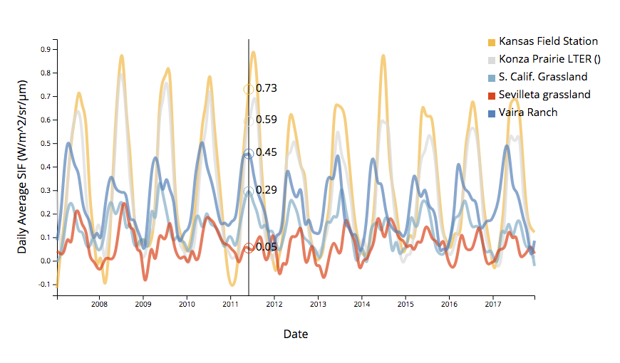

# Solar-Induced Chlorophyll Fluorescence

## An interactive timeseries

**interactive time series | updated May 9 2018 | grouped, continuous timeseries data | Contributors: [Lila Leatherman](https://github.com/lleather)**

**Prepared for GEOG 572: Geovisualization, Oregon State University**



[Live Demo](http://geoviz.ceoas.oregonstate.edu/neocarto/modules/time/timeseries/index.html)


##Overview

This is an interactive **time series** graph, suitable for visualizing **continuous** data. Unlike a [streamgraph](https://bl.ocks.org/mbostock/4060954), this interfave is more suitable for visualizing **cyclical data**. The interactive tooltip, which displays the value for each series, helps **compare values among groups**. 

## Data

These data displayed are monthly averages of daily average solar-induced chlorophyll fluorescence (SIF). Global SIF is available from [NASA](are available from [NASA](https://avdc.gsfc.nasa.gov/pub/data/satellite/MetOp/GOME_F/)) at 0.5 degree spatial resolution. These data are extracted to eddy covariance flux tower sites in the [Ameriflux](http://ameriflux.lbl.gov/) network. These sites in particular were chosen as grassy ecosystems that experience varying climate gradients. The distinct patterns in production and chlorophyll fluorescence are evident in in the distinct temporal patterns of production. 

Below is a sample of the data:

```
"date","site","name","sif","doy","year"
"2007-01-15","US-KFS","Kansas Field Station",-0.116402998566628,15,2007
"2007-02-15","US-KFS","Kansas Field Station",0.0461407974362373,46,2007
"2007-03-15","US-KFS","Kansas Field Station",0.142992585897446,74,2007
"2007-04-15","US-KFS","Kansas Field Station",0.343039631843567,105,2007
"2007-05-15","US-KFS","Kansas Field Station",0.521345436573029,135,2007
```

## Major Functions

### html functions

The html for this chart is fairly simple. I load in d3 v5, the Open Sans Font Family, and name the chart. 

```html
<!DOCTYPE html>
<html lang="en">
<head>
    <meta charset="UTF-8">
    <script src="https://d3js.org/d3.v5.js"></script>
    <link rel="stylesheet" href="css/style.css" />
    <link href="https://fonts.googleapis.com/css?family=Open+Sans" rel="stylesheet">

    <title>SIF Timeseries</title>

<!-- examples include https://bl.ocks.org/larsenmtl/e3b8b7c2ca4787f77d78f58d41c3da91 -->

</head>

<body>
<!-- <svg width="400" height="400"></svg> -->
<div id="chart"></div>
```

### js functions

What follows is the javascript code used to visualize the data. 

#### Set up the plot

First, I set up the dimensions and margins of the graph, set the ranges of the axes, and build the svg canvas. 

The time parsing functions ensure that the time variables are read in appropriately from my input .csv file.

```javascript
// set the dimensions and margins of the graph
    var margin = {top: 60, right: 100, bottom: 80, left: 80},
        width = 850 - margin.left - margin.right,
        height = 500 - margin.top - margin.bottom;

    // write functions to parse the date / time variables.
    var parseTime = d3.timeParse("%Y-%m-%d");
    var formatTime = d3.timeFormat("%e %B");
    
    // not used in plotting: functions to format time in terms of years and julian days, aka "day of year"
    //var formatYear = d3.timeFormat("%Y");
    //var parseYear = d3.timeParse("%Y");

    //var formatJday = d3.timeFormat("%j");
    //var parseJday = d3.timeParse("%j");

    // set the ranges
    var x = d3.scaleTime().range([0, width]);
    var y = d3.scaleLinear().range([height, 0]);

        // Adds the svg canvas
    var svg = d3.select("#chart")
        .append("svg")
        .attr("width", width + margin.left + margin.right)
        .attr("height", height + margin.top + margin.bottom)
        .append("g")
        .attr("transform",
            "translate(" + margin.left + "," + margin.top + ")");
```

I set up the color scheme, using d3.scaleOrdinal to name the colors I want to include.

(I have named the variables I use to determine the colors; I'm not sure how to set a specific color to a specific variable, though?)

```js
// Set the color scheme
var colors = d3.scaleOrdinal()
    //.domain(["Kansas Field Station", "Konza Prairie LTER()", "S. Calif. Grassland", "Sevilleta grassland", "Vaira Ranch"])
    .range(["#5581BA", "#f3bb3b", "#dcdbdb", "#84aec8", "#dc4404" ]);
```

#### Line plotted using interpolation

Creating a line based on interpolation between data points allows the tooltip display function to display continuous data, rather than only displaying data at points where the data appear in the original data set.

```javascript
// define the line
var valueLine = d3.line()
    .x(function(d) { return x(d.date); })
    .y(function(d) { return y(+d.sif); })
    .curve(d3.curveBasis); // interpolates the curve between points
```

####Multiple series plotted by nesting data

First, I have to load in the data. But, importantly, in order to visualize multiple variables separately, in a ["long"](https://sejdemyr.github.io/r-tutorials/basics/wide-and-long/) dataset, I [nested](https://amber.rbind.io/blog/2017/05/02/d3nest/) the dataframe by a grouping variable, "name", which is unique for each site in the dataset. 

```javascript
// Get the data
    d3.csv("assets/gome_ts/gome_sif_monthly_mult_forjs.csv").then(function(data) {

        // format the data
        data.forEach(function(d) {
            d.date = parseTime(d.date);
            d.sif = +d.sif;
            d.site = d.site;
            d.name = d.name;
            //d.year = formatYear(parseYear(+d.year));
            //d.doy = formatJday(parseJday(+d.doy));
        });

// nest the data by group
var nest = d3.nest()
    .key(function(d) {
        return d.name; // variable to nest by
    } )
    .entries(data);
```

The rest of the functions for plotting and visualizing the data are nested within the d3.csv().then() function.

####set up the data and axes for plotting

```js
// Scale the range of the data
x.domain(d3.extent(data, function(d) { return d.date; }));
y.domain(d3.extent(data, function(d) { return d.sif; }));

// Add the X Axis
var xaxis = svg.append("g")
    .attr("transform", "translate(0," + height + ")")
    .attr("class", "x axis")
    .call(d3.axisBottom(x));

// Add the Y Axis
var yaxis = svg.append("g")
    .attr("class", "y axis")
    .call(d3.axisLeft(y));

// Add a label to the y axis
svg.append("text")
    .attr("transform", "rotate(-90)")
    .attr("y", 0 - 60)
    .attr("x", 0 - (height / 2))
    .attr("dy", "1em")
    .style("text-anchor", "middle")
    .text("Daily Average SIF (W/m^2/sr/µm)")
    .attr("class", "y axis label");

// add a label to the x axis
svg.append("text")
    .attr("transform",
        "translate(" + (width/2) + " ," +
        (height + margin.top + 0) + ")")
    .style("text-anchor", "middle")
    .text("Date")
    .attr("class", "x axis label");;

// add the valueLine path
        svg.selectAll(".line")
            .data(nest)
            .enter()
            .append("path")
            .attr("class", "line")
            .attr("stroke", function(d){ return colors(d.key)}) // Adding color!
            .attr("d", function(d){
                return valueLine(d.values);
```

#### build a  legend to identify the color of each line

```js
// add legend
var legend = svg.append("g")
    .attr("class", "legend")
    .attr("x", width - 65)
    .attr("y", 25)
    .attr("height", 100)
    .attr("width", 100);

legend.selectAll('g').data(nest)
    .enter()
    .append('g')
    .each(function(d, i) {
        var g = d3.select(this);
        g.append("rect")
            .attr("x", width - 65)
            .attr("y", i * 25)
            .attr("width", 10)
            .attr("height", 10)
            .style("fill", function (d) {
                return colors(d.key);
            });

        g.append("text")
            .attr("x", width - 50)
            .attr("y", i * 25 + 8)
            .attr("height", 30)
            .attr("width", 100)
            //.style("fill", function (d) {
            //    return colors(d.key);
            //})
            .text(function (d) {
                return d.key;
            });
    });
```


####Interactive tooltip

A mouseover function provides colored circles and text that represent the interpolated y-value for each group at the closest x-value where the mouse is located. The tooltip is only visible when the mouse is on the plot. This code was adapted from [larsenmtl](https://bl.ocks.org/larsenmtl/e3b8b7c2ca4787f77d78f58d41c3da91). 

First we have to create a mouse effects class, and I add a black vertical line to follow the mouse and orient the eye to the mouse position on the x-axis. 

```js
// BUILDING MOUSEOVER EFFECTS
// create mouse effects class
var mouseG = svg.append("g")
    .attr("class", "mouse-over-effects");

// add black vertical line to follow mouse
mouseG.append("path")
    .attr("class", "mouse-line")
    .style("stroke", "black")
    .style("stroke-width", "1px")
    .style("opacity", "0");
```

I also set up a mouse effects class, add circles to each line to follow the mouse function, and create categories into which to append the data from the chart.

```js
//add our data to the mouse effects class
var mousePerLine = mouseG.selectAll('.mouse-per-line')
    .data(nest)
    .enter()
    .append("g")
    .attr("class", "mouse-per-line");

// add circles on each line, to follow mouse function
mousePerLine.append("circle")
    .attr("r", 7)
    .style("stroke", function(d) {
        return colors(d.key);
    })
    .style("fill", "none")
    .style("stroke-width", "1px")
    .style("opacity", "0");

// add text to follow mouse movement
mousePerLine.append("text")
    .attr("transform", "translate(10,3)");
```


Lastly and most importantly, I append a rect the same size as the plot to catch the mouse movements across the canvas. I collect the data acquired by the mouse as it moves across the canvas by accessing the mouse[0] attribute, and return this data for each nested line.

```js
// append a rect to catch mouse movements on canvas
    // can't catch mouse events on a g element
    // format rectangle to be an empty object, just made to catch the mouse events
mouseG.append('svg:rect')
    .attr('width', width)
    .attr('height', height)
    .attr('fill', 'none')
    .attr('pointer-events', 'all')
    .on('mouseout', function() { // on mouse out hide line, circles and text
        d3.select(".mouse-line")
            .style("opacity", "0");
        d3.selectAll(".mouse-per-line circle")
            .style("opacity", "0");
        d3.selectAll(".mouse-per-line text")
            .style("opacity", "0");
    })


    .on('mouseover', function() { // on mouse in show line, circles and text
        d3.select(".mouse-line")
            .style("opacity", "1");
        d3.selectAll(".mouse-per-line circle")
            .style("opacity", "1");
        d3.selectAll(".mouse-per-line text")
            .style("opacity", "1");
    })


    // collects data from mouse moving over canvas
    //mouse[0] represents mouse position
    .on('mousemove', function() {
        var mouse = d3.mouse(this);
        d3.select(".mouse-line")
            .attr("d", function() {
                var d = "M" + mouse[0] + "," + height;
                d += " " + mouse[0] + "," + 0;
                return d;

            });


        //i think this is a fancier version than may be strictly necessary
        // but perhaps is required for nested data?


        d3.selectAll(".mouse-per-line")
            .attr("transform", function(d, i) {
                //console.log(width/mouse[0])
                //console.log(x.invert(mouse[0]))
                var xDate = x.invert(mouse[0]), // get x-value at mouseover
                    bisect = d3.bisector(function(d) { return d.date; }).right;
                idx = bisect(d.values, xDate); // get index of y-value at x-value on mouseover
                //console.log(idx)

                var beginning = 0,
                    end = lines[i].getTotalLength(),
                    target = null;


                while (true){
                    target = Math.floor((beginning + end) / 2); //default target is the middle of line
                    pos = lines[i].getPointAtLength(target);
                    if ((target === end || target === beginning) && pos.x !== mouse[0]) {
                        break; // don't return anything if the mouse isn't on the rect
                    }
                    //return position when mouse is within the length of the paths
                    if (pos.x > mouse[0])      end = target;
                    else if (pos.x < mouse[0]) beginning = target;
                    else break; //position found
                }

                d3.select(this).select('text')
                    .text(y.invert(pos.y).toFixed(2));

                return "translate(" + mouse[0] + "," + pos.y +")"; //this is returned as "transform" attribute of mouse-per-line
            });
    });
```

## More similar data visualizations

* [Cubism](http://square.github.io/cubism/): for visualizing grouped time series, separately. Best-suited for data aquired in real-time.
* [D3-timeseries](http://mcaule.github.io/d3-timeseries/): provides multiple add-ons for visualizing time series, but was difficult for me to adapt and implement.
* [Mike Bostock](https://bl.ocks.org/mbostock/3902569) provides a simple function for obtaining the x-value of a mouseover.

## Primary sources

* nesting data: [Amber Thomas](https://amber.rbind.io/blog/2017/05/02/d3nest/0)
* mouseover function: [larsenmtl](https://bl.ocks.org/larsenmtl/e3b8b7c2ca4787f77d78f58d41c3da91)

