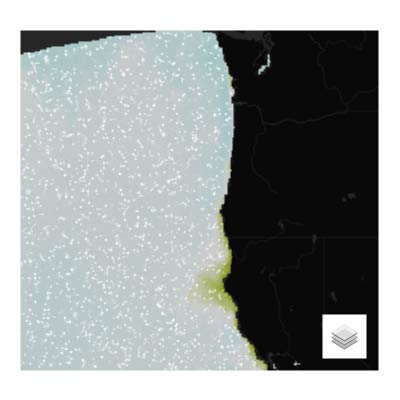
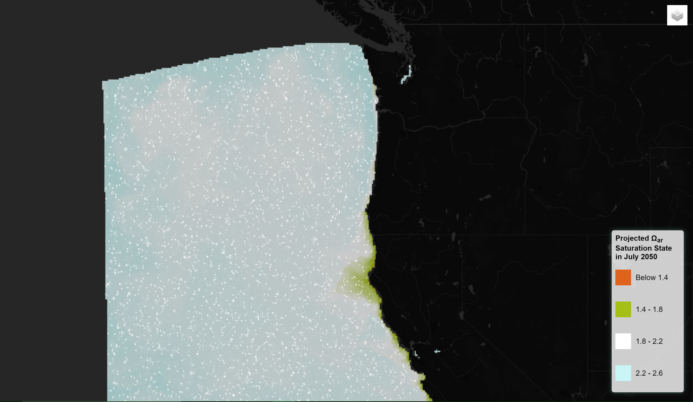
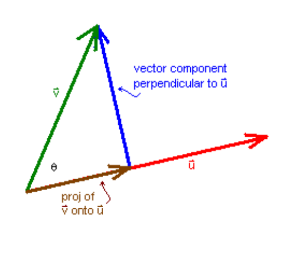
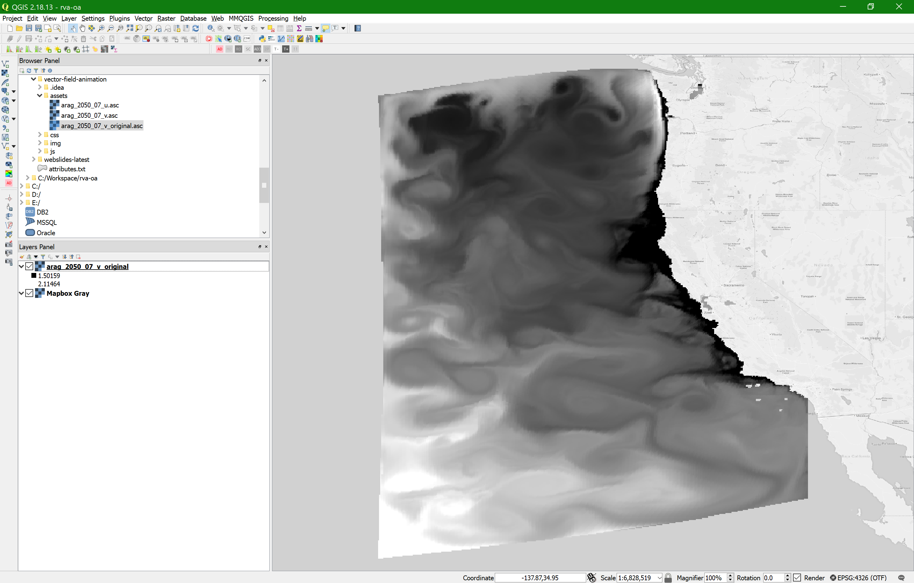
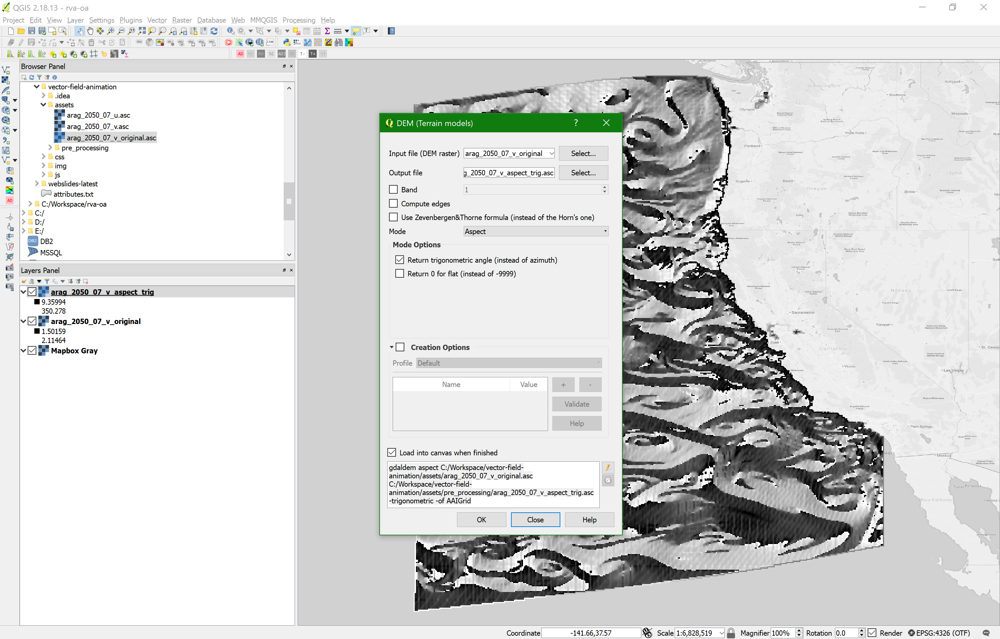
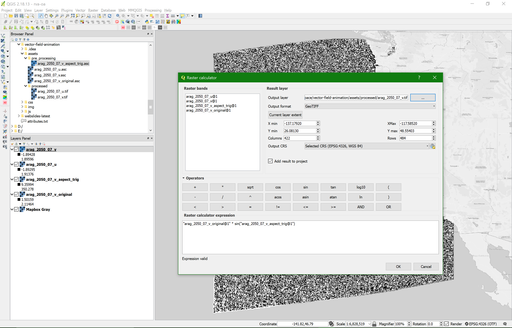
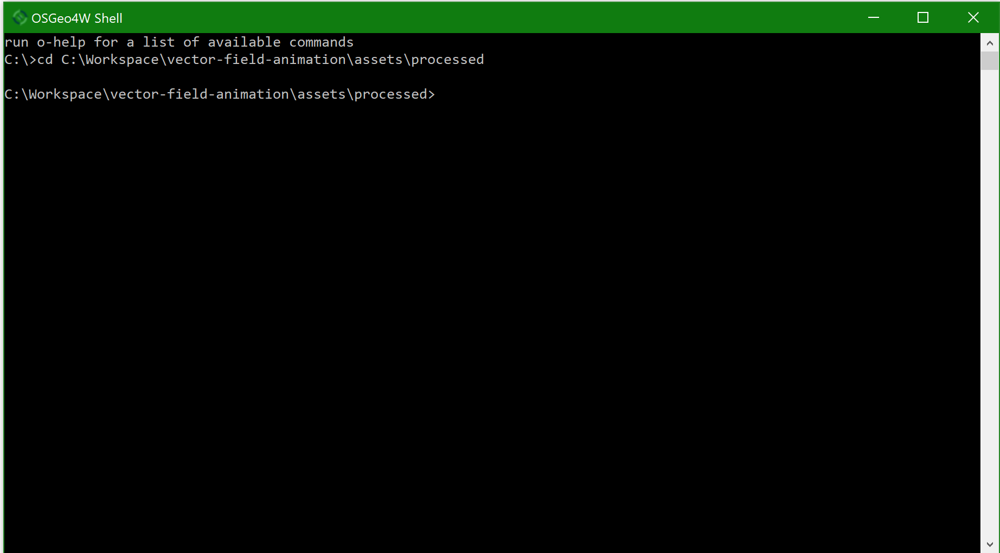
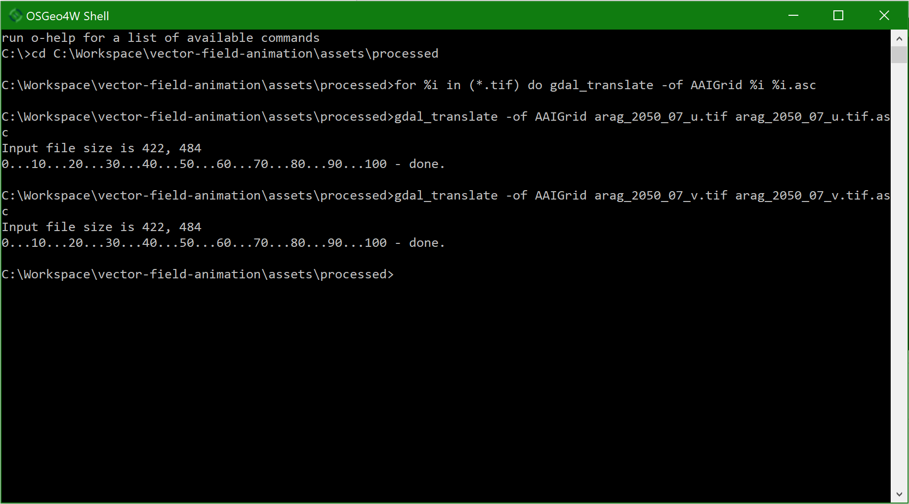
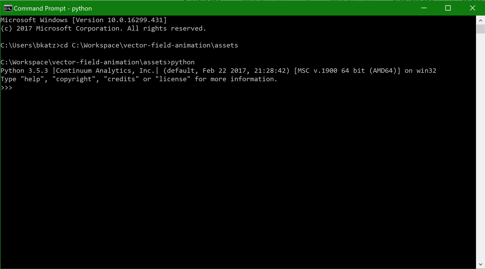
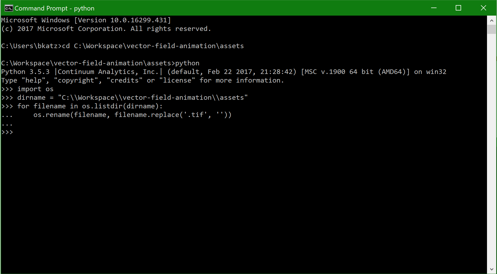

# Leaflet Vector Field Animation

**Raster to Animated Vector** | **Updated: 05/19/2018** | **ASCII Raster Data (*.asc)** | **Contributor:** [Brian Katz](https://github.com/briangkatz)



This module allows you to convert a continuous raster dataset into an animated vector field which visualizes the magnitude and direction of the raster data's pixel values.

[**Demo**](https://briangkatz.github.io/vector-field-animation/)



```
[vector-field-animation]
    ├─assets
    |   └─pre_processing
    |     └─arag_2050_07_v_aspect_trig.asc
    |   └─processed
    |     └─arag_2050_07_u.tif
    |     └─arag_2050_07_v.tif
    |   └─arag_2050_07_u.asc
    |   └─arag_2050_07_v.asc
    |   └─arag_2050_07_v_original.asc
    ├─css
    |   └─leaflet.css
    │   └─main.css
    ├─img
    │   └─final.png
    │   └─step1.png
    │   └─step2.png
    │   └─step3gdal1.png
    │   └─step3gdal2.png
    │   └─step3python1.png
    │   └─step3python2.png
    │   └─step3python3.png
    │   └─step3translate.png
    │   └─step3u.png
    │   └─step3v.png
    │   └─step3v.png
    │   └─step3v.png
    |   └─vector_components.png
    |   └─vector_field.jpg
    |   └─vector_field.png
    │   └─vector_field_animation.png
    │   └─vector_field_direction.png
    │   └─vector_field_magnitude.png
    ├─js
    |   └─chroma.min.js
    |   └─d3.v4.min.js
    │   └─leaflet.canvaslayer.field.js
    |   └─leaflet.js
    │   └─main.js
    │index.html
    |LICENSE
    │readme.md
```


## 1\. Set up the workspace

In your IDE (Webstorm), open `index.html` to prepare for editing.


### 1.1 Add Stylesheets 

``` html
<!-- Stylesheets -->
<link rel="stylesheet" href="https://unpkg.com/leaflet@1.2.0/dist/leaflet.css" />
<link rel="stylesheet" href="css/main.css" />
<link href="https://fonts.googleapis.com/css?family=Open+Sans" rel="stylesheet" />
```


### 1.2 Add Javascript Libraries

``` html
<!-- External Libraries -->
<script src="js/d3.v4.min.js"></script>
<script src="js/leaflet.js"></script>
<script src="js/chroma.min.js"></script>
```


### 1.3 Create the Map div

This module nests the map div within a "map-container" div in order to scale the module down to 400px by 400px with top/bottom margins of 30px and left/right margins of 20px. The margins are set by CSS styling assigned by id="map-container" in the `main.css` file

``` html
<!-- Create the Map div -->
<div id="map"></div>
```


### 1.4 Add the two main JavaScript files into the HTML `<body>`

``` html
<body>
    <!-- Create the Map div -->
    <div id="map"></div>

    <!-- Leaflet CanvasLayer.Field JavaScript -->
    <script src="js/leaflet.canvaslayer.field.js"></script>

    <!-- Main JavaScript -->
    <script src="js/main.js"></script>
</body>
```


## 2\. Data Sources and Processing

This module requires raster data in *ASCII Grid format* (*.asc).

Before visualization, each raster you begin with must be processed into **two ASCII files** that represent vector components of your original data. These components are called  **U** and **V**.

- **V** relates to the vector **magnitude**
- **U** relates to the vector **direction**



Source: [Elementary Vector Analysis](https://www.math.hmc.edu/calculus/tutorials/vectoranalysis/vectoranalysis.pdf)

In the figure above, the perpendicular lines represent the **V** (blue) and **U** (red) vector components that the Leaflet.CanvasLayer.Field library uses to dynamically calculate and animate the original data's magnitude (pixel values). Thus, the *green* line labeled **v** represents your starting ASCII raster that you want visualized from two other ASCII rasters, **V** and **U**.


The following sections lay out a workflow to:

1. Start with an ASCII file (**v**)

2. Create a "theta" raster (**&theta;**) in *math degrees* using the DEM Aspect tool in QGIS

3. Calculate **V** and **U** rasters from the **v** and **&theta;** rasters

   ​

### 2.1 Start with an ASCII file (**v**)

In the `assets` folder, you'll see the original raster file used in this example:  `arag_2050_07_v_original.asc`. This data represents projected aragonite saturation state in July 2050, and it is sourced from an ocean acidification (OA) model output by [Hauri and Gruber et al. 2013](https://agupubs.onlinelibrary.wiley.com/doi/epdf/10.1002/grl.50618). Aragonite saturation state is a measure of water corrosivity to bivalve shell-development, a proxy for OA intensity.

##### Step 1: Open `arag_2050_07_v_original.asc` in QGIS




### 2.2 Create a "theta" raster (**&theta;**) using the DEM Aspect tool in QGIS

##### Step 2: From the QGIS menu, go to `Raster > Analysis > DEM (Terrain Models)`

- Save the output file to the `pre_processing` folder as `arag_2050_07_v_aspect_trig.asc`
- Select Mode: Aspect
- Check the `Return trigonometric angle (instead of azimuth)` box - **very important!** (*math degrees*)
- Click OK



Alternatively, use the following GDAL command in OSGeo4W:

```python
# GDAL DEM Aspect w/Trigonometric Angle
gdaldem aspect input_file output_file -trigonometric -of AAIGrid

# Step 2.2 Example
gdaldem aspect C:/Workspace/vector-field-animation/assets/arag_2050_07_v_original.asc C:/Workspace/vector-field-animation/assets/pre_processing/arag_2050_07_v_aspect_trig.asc -trigonometric -of AAIGrid
```

The resulting output file `arag_2050_07_v_aspect_trig.asc` is your **&theta;** raster to use in the next step.


### 2.3 Calculate **V** and **U** rasters from the **v** and **&theta;** rasters

Now we have our magnitude (**v**) and direction (**&theta;**) rasters from which we can calculate our **U** and **V** rasters.

We'll use the Raster Calculator tool in QGIS to perform the following functions:

**U** = **v** * cos(**&theta;**) =  `arag_2050_07_v_original.asc` * cos(`arag_2050_07_v_aspect_trig.asc`)

​	**U** = `arag_2050_07_u.asc`

**V** = **v** * sin(**&theta;**) =  `arag_2050_07_v_original.asc` * sin(`arag_2050_07_v_aspect_trig.asc`)

​	**V** = `arag_2050_07_v.asc`

##### Step 3: From the QGIS Menu, go to `Raster > Raster Calculator...`

- Save the output file to the `processed` folder as `arag_2050_07_u.tif`

  - The Raster Calculator in QGIS doesn't allow you to select ASCII *.asc format from the interface, so we have to save as a GeoTIFF here before converting back to ASCII for use by L.CanvasField.Layer.js

  

- Repeat the process for an `arag_2050_07_v.tif` file

  

- Now convert the *.tif files back to *.asc and place the final **U** and **V** output rasters in the `assets` folder

  - ##### From the QGIS menu, go to `Raster > Conversion > Translate (Convert Format)...` 

    - Check the `Batch mode (for processing whole directory)` box
    - Input directory: `C:\Workspace\vector-field-animation\assets\processed`
      - (where your **U** and **V** *GeoTIFF* files are located)
    - Output directory: `C:\Workspace\vector-field-animation\assets`
      - (where your final, processed **U** and **V** *ASCII* files will be saved)
    - Output format: `Arc/Info ASCII Grid (*.asc *.ASC)`
    - Target SRS: `EPSG:4326` (web mercator)
    - Click OK and your final **U** and **V** ASCII files should now be ready for visualization in the `assets` folder:
      - `arag_2050_07_u.asc`
      - `arag_2050_07_v.asc`

  - ##### If the method above doesn't work, use GDAL:

    - Open the OSGeo4W Shell and enter the following commands:

    ``` python
    # Enter the folder where the U and V .tif files are located
    cd C:\Workspace\vector-field-animation\assets\processed
    ```

    

    ``` python
    # Batch process .tif files to .asc using GDAL TRANSLATE
    for %i in (*.tif) do gdal_translate -of AAIGrid %i %i.asc
    ```

    

    - Your output files are now called `arag_2050_07_u.tif.asc` and `arag_2050_07_v.tif.asc` so we must now change the file names to remove the extra .tif extension

    - You may do this manually...or with Python:

      - Close QGIS

      - Move the `arag_2050_07_u.tif.asc` &`arag_2050_07_v.tif.asc` files into the `assets` folder

      - Open Command Prompt

        ``` python
        # Enter the assets folder in your vector-field-animation repository folder
        cd C:\Workspace\vector-field-animation\assets
        ```

        

      - Initiate Python

        ``` python
        # Initiate the Python interpreter
        python
        ```

        

      - Enter the following Python commands (without the comments):

        ``` python
        # Rename files in a directory

        import os

        # specify the directory of files to iterate through
        dirname = "C:\\Workspace\\vector-field-animation\\assets"

        # iterate through files and remove some specified text if it's found in the file name
        for filename in os.listdir(dirname):
            # use the replace() function to blank out text, i.e. replace('text_you_want_to_remove', '') 
            os.rename(filename, filename.replace('.tif', ''))
        ```

        

      - You may remove the .xml and .prj files in `assets` - they are not needed for the visualization

      - Your final **U** and **V** ASCII files should now be ready for visualization in the `assets` folder:

        - `arag_2050_07_u.asc`
        - `arag_2050_07_v.asc`


##### Now we're finally ready to dive into the functions of the Leaflet.CanvasField.Layer library with our processed data.

​	:fireworks:👏 👏 👏		**Woohoo!**	 :clap: :clap: :clap: :fireworks:


## 3\. A function-by-function Tutorial

This tutorial walks through the functions of the `main.js` file.

1. Create a Leaflet map object, set a base map, and set your bounding box and zoom parameters

``` javascript
// Create the Leaflet map object to place inside the Map div (id="map")
var map = L.map("map");

// Assign a Leaflet Tile Layer Basemap from CartoDB, Mapbox, etc.
var url = 'https://cartodb-basemaps-{s}.global.ssl.fastly.net/dark_nolabels/{z}/{x}/{y}.png';  // replace the URL with a basemap of your choosing
L.tileLayer(url, {
    attribution: 'CartoDB', // attribute the source of your basemap
    maxZoom: 10,  // set the max zoom level
    minZoom: 5  // set the min zoom level
}).addTo(map);  // add the base map to the Leaflet map object

// Bounding Box
var corner1 = L.latLng(48, -130.5),
    corner2 = L.latLng(38, -120.5),
    bounds = L.latLngBounds(corner1, corner2);
map.fitBounds(bounds);  // fit the map bounds to the bounding box specified
```

2. Load the **U** and **V** ASCII files with D3 and set the following parameters to your choosing:
   - `var magnitude`: color scale of *magnitude layer* (set chroma colors and breakpoints)
   - `var direction`: size and color of *direction arrow layer*
   - `var animation`: number of, style of, and speed of *animated vector layer*
   - `L.control.layers`: the layer choices and position of a Leaflet layer-toggler control
   - `var legend`: customize your legend
   - `magnitude.on()` and `direction.on()`: customizes the popups when you click a layer for its values

```javascript
// ScalarField derived from a Vectorfield (from IHCantabria Leaflet.CanvasLayer.Field)
d3.text('assets/arag_2050_07_u.asc', function (u) { // add the U data in ASCIIGrid (.asc) format
    d3.text('assets/arag_2050_07_v.asc', function (v) { // add the V data in ASCIIGrid (.asc) format (if you want to see a flowing example, replace the V data with the v data (arag_2050_07_v_original.asc)
        var toMetersPerSecond = 0.5; // coefficient multiplied with the U and V data to determine the speed (magnitude) of the animated vector field; larger coefficient result in faster animation speeds (larger magnitudes), smaller coefficient (i.e. decimals) result in slower animation speeds (smaller magnitudes); **This number may need to be modified to normalize the data values as close to their original values as possible. A coefficient very large will overstate the data values, and a small coefficient may understate the data values** Original example was 0.001
        var vf = L.VectorField.fromASCIIGrids(u, v, toMetersPerSecond);  // create the vector field

        // a) First derived field: Magnitude (m/s, or Omega aragonite saturation state)
        var s = vf.getScalarField('magnitude');  // << derived ScalarField
        // custom scale, based on 'earth.nullschool.net' (example:  https://earth.nullschool.net/#current/ocean/surface/currents/overlay=currents/equirectangular=-11.95,29.62,1112)
        var magnitude = L.canvasLayer.scalarField(s, {
            color: chroma.scale(
                ['#E0631D', '#E0631D', '#A5BF15', '#FFFFFF', '#C9F5F6'], [1.0, 1.4, 1.8, 2.2, 2.6]  // set color scale and break points for styling of magnitude layer
            ),
            opacity: 0.75 // 1 will block view of animation if magnitude layer is selected and brought to the front of the map object
        }).addTo(map);  // addTo(map) displays the layer on page-load vs. removing it keeps the layer off the map until the check-box is selected in the Leaflet layer control (see direction layer below for example)

        // b) Second derived field: DirectionFrom (º): (0 to 360º) | N is 0º and E is 90º
        var direction = L.canvasLayer.scalarField(
            vf.getScalarField('directionFrom'), {
                type: 'vector',
                color: '#DCDBDB',  // set color of direction arrows
                vectorSize: 20,  // set the size of the direction arrows
                arrowDirection: 'from'
            });

        // Animation field
        var animation = L.canvasLayer.vectorFieldAnim(vf, {
            id: "canvas",
            paths: 5000,  // set the number of concurrent animations; 1 is one movement animated at a time, 5000 is five thousand movements animated at a time
            fade: 0.97, // 0 animates sharp point movements with no line visible; 1 animates streamlike paths with an always-visible line; anything between 0 and 1 creates a line that fades away after the animation movement
            maxAge: 100,  // how many milliseconds should the animated movement last from start to end points
            velocityScale: 1 / 50,  // a velocityScale of 1 results in a crazy fast animation speed, and a velocityScale of 0 results in no animation whatsoever (no velocity) -- therefore, set velocityScale to a fraction value instead (i.e. 1 / 200). A fraction closer to 1 (i.e. smaller denominator; e.g. 1 / 50) will be faster than a fraction closer to 0 (i.e. larger denominator; e.g. 1 / 200)
            color: 'rgba(255, 255, 255, 0.7)'  // set color and opacity of animation
        }).addTo(map);

        // Leaflet layer control - for toggling between views of animation, magnitude, and direction layers
        L.control.layers({}, {
            "Vector animation": animation,
            "Derived magnitude": magnitude,
            "Derived direction": direction,
        }, {
            position: 'topright',  // change to your preference
            collapsed: true  // false always displays check-boxes for the animation, magnitude, and direction layers; true creates a layer-selector icon which hides these check-boxes until hovered over or clicked on
        }).addTo(map);

        // define legend
        var legend = L.control({position: 'bottomright'});
        // set legend color scale and breaks
        legend.onAdd = function () {
            var div = L.DomUtil.create('div', 'legend legend-colors');
            div.innerHTML += '<b>Projected &Omega;<sub>ar</sub> Saturation State in July 2050</b><br><br>';
            div.innerHTML += '<i style="background: ' + '#E0631D' + '; opacity: 1"></i><p>Below 1.4</p><br>';
            div.innerHTML += '<i style="background: ' + '#A5BF15' + '; opacity: 1"></i><p>1.4 - 1.8</p><br>';
            div.innerHTML += '<i style="background: ' + '#ffffff' + '; opacity: 1"></i><p>1.8 - 2.2</p><br>';
            div.innerHTML += '<i style="background: ' + '#C9F5F6' + '; opacity: 1"></i><p>2.2 - 2.6</p>';
            return div;
        };

        legend.addTo(map);

        // create a popup displaying magnitude values when a pixel is clicked
        magnitude.on('click', function (e) {
            if (e.value !== null) {
                var v = e.value.toFixed(2);
                var html = (`<span class="popupText">magnitude: ${v*2} &Omega; <sub>ar</sub></span>`); // multiply value by 2 to compensate for toMetersPerSecond 0.5
                var popup = L.popup().setLatLng(e.latlng).setContent(html).openOn(map);
            }
        });

        // create a popup displaying direction values when a pixel is clicked
        direction.on('click', function (e) {
            if (e.value !== null) {
                var v = e.value.toFixed(0);
                var html = (`<span class="popupText">direction: ${v}&deg;</span>`);
                var popup = L.popup().setLatLng(e.latlng).setContent(html).openOn(map);
            }
        });
    });
});

```


## 4\. More examples of similar geovisualizations

[Earth - nullschool](https://earth.nullschool.net)

[Leaflet-CanvasLayer-Field Examples - IHCantabria](https://ihcantabria.github.io/Leaflet.CanvasLayer.Field/)


## Acknowledgement

This module is based on the Leaflet.CanvasLayer.Field library from [Victor Velarde](https://github.com/IHCantabria/Leaflet.CanvasLayer.Field). Special thanks to [Bo Zhao](https://www.github.com/jakobzhao/) for his encouragement and passion for inspiring students to pursue new ideas.

## References

1. [IHCantabria Leaflet.CanvasLayer.Field (GitHub)](https://github.com/IHCantabria/Leaflet.CanvasLayer.Field)
2. [U and V Components](http://colaweb.gmu.edu/dev/clim301/lectures/wind/wind-uv)
3. [Elementary Vector Analysis](https://www.math.hmc.edu/calculus/tutorials/vectoranalysis/vectoranalysis.pdf)
4. [QGIS](https://qgis.org/en/site/forusers/download.html)
5. [OSGeo4W](https://trac.osgeo.org/osgeo4w/) (GDAL)
6. [Python](https://www.python.org/)